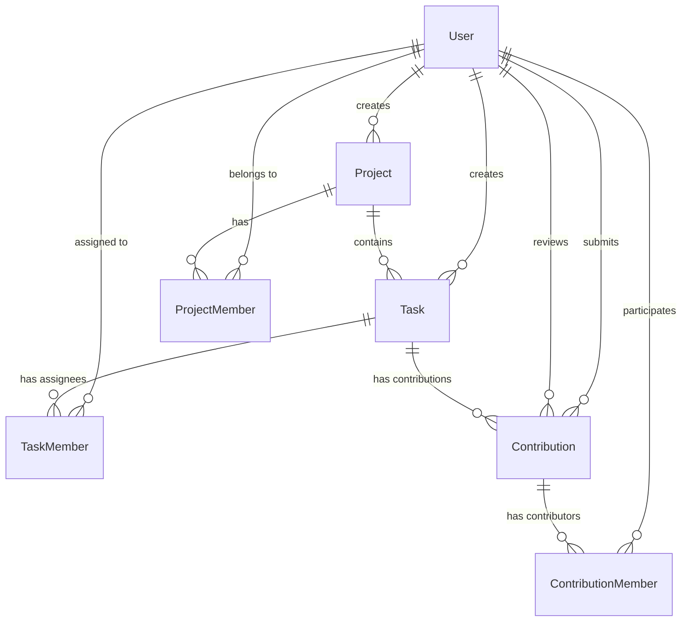

# ContriFlow — Club Contribution Tracker

ContriFlow is a project-centric collaboration platform designed specifically for student clubs, teams, and organizations to manage tasks, track contributions, and maintain a verified, structured record of member involvement. 

Unlike traditional task managers, ContriFlow shifts the focus from simply marking tasks as complete to documenting and recognizing the meaningful contributions made by individuals and teams.

---

## 📌 Problem & Solution

### The Problem
Student clubs and project teams often struggle with:
* **Fragmented Activity:** Relying on scattered WhatsApp/Discord chats, spreadsheets, and drive links, leading to lost info.
* **Invisible Contributions:** Difficulty in recognizing and tracking non-coding contributions such as design, documentation, event management, and outreach.
* **Lack of Verification:** No formal validation system for who completed what task, making it hard to trust contribution histories.
* **Leadership Handover Issues:** Difficulty in preserving historical contribution data for future leadership transitions.

### The Solution
ContriFlow provides a centralized platform that enables teams to:
* **Track Verified Involvement:** Create and manage projects where members join using unique invite codes.
* **Document Work with Evidence:** Allow contributors to submit evidence/proof links for the work they perform.
* **Establish an Approval Workflow:** Enable project leads to review, approve, or reject contributions with actionable feedback.
* **Generate Portfolios:** Build a centralized, verified record of each member's contributions and role history.

---

## 🛠️ Tech Stack

### Frontend
* **React 19 & TypeScript:** Type-safe, component-driven user interface.
* **Vite:** High-performance local development server and bundler.
* **Tailwind CSS v4:** Modern utility-first styling.
* **Radix UI:** High-quality, accessible primitive components.
* **Lucide React:** A clean and consistent icon library.
* **React Hook Form & Zod:** Robust form validation and client-side schemas.
* **Axios:** Promise-based HTTP client with request interceptors for automatic JWT header attachments.
* **Sonner:** Sleek toast notifications.

### Backend
* **Node.js & Express.js:** Fast, minimalist web framework for building server APIs.
* **Prisma ORM:** Modern database toolkit for PostgreSQL, handling database schema design, migrations, and type-safe database queries.
* **PostgreSQL:** Relational database management system.
* **JSON Web Token (JWT) & bcryptjs:** Secure token-based user authentication and password hashing.

---

## 📁 Repository Structure

```text
club-contribution-tracker/
├── client/                      # Frontend Application (React, Vite, TS)
│   ├── src/
│   │   ├── components/          # Reusable UI elements & component-specific dialogs
│   │   ├── context/             # React Context for global state (e.g. Auth)
│   │   ├── lib/                 # Core utilities and schemas
│   │   ├── pages/               # Page views (Auth, Projects, Tasks, Dashboard)
│   │   ├── routes/              # App Router and Protected Route components
│   │   ├── services/            # API communication services (Axios interceptor)
│   │   └── types/               # TypeScript interface definitions
│   ├── package.json
│   └── tsconfig.json
│
├── server/                      # Backend API Server (Node, Express)
│   ├── prisma/
│   │   ├── schema.prisma        # Prisma DB models and relations
│   │   └── migrations/          # SQL database migration history
│   ├── src/
│   │   ├── controllers/         # Business logic functions per endpoint
│   │   ├── middleware/          # Express middlewares (Authentication, validation)
│   │   ├── routes/              # Express API routing tables
│   │   ├── services/            # Low-level service layers (DB abstraction)
│   │   ├── utils/               # Helper utilities (token generator, etc.)
│   │   └── app.js               # Entry point of the Express server
│   ├── scripts/                 # Server verification and smoke-testing scripts
│   └── package.json
└── README.md                    # Project Documentation
```

---

## 🗄️ Database Design

The database schema is managed using Prisma and runs on PostgreSQL. Below are the key entities and relationships:



### Models Summary

| Model | Description | Fields / Key Relations |
| :--- | :--- | :--- |
| **User** | System users representing leads or contributors. | `id`, `name`, `email`, `password`, `createdAt` |
| **Project** | Workspace managed by a lead. | `id`, `name`, `description`, `inviteCode`, `createdById` |
| **ProjectMember** | Join table linking Users and Projects with a role. | `userId`, `projectId`, `role` (`LEAD`, `MEMBER`) |
| **Task** | Deliverables inside a project. | `id`, `title`, `description`, `deadline`, `status` (`TODO`, `IN_PROGRESS`, `DONE`) |
| **TaskMember** | Association linking Users assigned to specific Tasks. | `taskId`, `userId`, `roleInTask` |
| **Contribution** | Evidence-backed work submitted for a task. | `id`, `title`, `description`, `proofUrl`, `status` (`PENDING`, `APPROVED`, `REJECTED`), `feedback` |
| **ContributionMember** | Association tracking multiple contributors for a single submission. | `contributionId`, `userId` |

---

## 🔌 API Documentation

All routes (except `/api/auth`) require a JWT header: `Authorization: Bearer <token>`.

### Authentication
* **`POST /api/auth/register`** — Register a new account.
* **`POST /api/auth/login`** — Log in and retrieve a JWT.
* **`GET /me`** — Fetch current logged-in user profile details.

### Projects
* **`POST /api/projects`** — Create a new project (making the creator `LEAD`).
* **`GET /api/projects`** — Get all projects the user is a member of.
* **`GET /api/projects/:projectId`** — Retrieve detailed project info (with member roles).
* **`POST /api/projects/join`** — Join a project using its unique `inviteCode`.
* **`GET /api/projects/:projectId/tasks`** — Fetch all tasks associated with a project.

### Tasks
* **`POST /api/tasks`** — Create a new task (Project Lead only).
* **`GET /api/tasks/:taskId`** — Retrieve task details and assignees.
* **`POST /api/tasks/:taskId/assign`** — Assign members to a task.
* **`PATCH /api/tasks/:taskId`** — Update task details or status (`TODO`, `IN_PROGRESS`, `DONE`).
* **`DELETE /api/tasks/:taskId`** — Delete a task.

### Contributions
* **`POST /api/contributions`** — Submit a contribution with supporting proof/URLs for a task.
* **`GET /api/contributions/:contributionId`** — Retrieve detailed contribution records.
* **`PATCH /api/contributions/:contributionId`** — Edit contribution metadata.
* **`DELETE /api/contributions/:contributionId`** — Delete a contribution submission.
* **`GET /api/contributions/task/:taskId`** — Fetch contributions for a specific task.
* **`PATCH /api/contributions/:contributionId/review`** — Approve/Reject a contribution with optional feedback (Project Lead only).

### Dashboard / Analytics
* **`GET /api/dashboard/:projectId`** — Fetch stats summary (Total tasks, completed, pending reviews) for a project.
* **`GET /api/dashboard/:projectId/members`** — Retrieve member-wise contribution stats (e.g. approved vs pending tasks per user).

---

## ⚡ Getting Started

### Prerequisites
Make sure you have the following installed on your system:
* **Node.js** (v18 or higher)
* **npm** (bundled with Node.js)
* **PostgreSQL** database running locally or hosted online.

---

### Setup Instructions

#### 1. Clone the repository
```bash
git clone https://github.com/iqbhavya/ContriFlow.git
cd club-contribution-tracker
```

#### 2. Configure & Run Backend Server
Navigate to the server directory:
```bash
cd server
```

Install dependencies:
```bash
npm install
```

Create a `.env` file in the `server` directory and define your connection string and JWT secret:
```env
DATABASE_URL="postgresql://<username>:<password>@localhost:5432/<db_name>?schema=public"
JWT_SECRET="your_secure_random_jwt_secret"
```

Run database migrations to apply the schema to PostgreSQL:
```bash
npx prisma migrate dev --name init
```

Generate the Prisma Client:
```bash
npx prisma generate
```

Start the backend API server:
```bash
node src/app.js
```
*(Server will start listening on `http://localhost:3000`)*

---

#### 3. Configure & Run Frontend Client
Open a new terminal window and navigate to the client directory:
```bash
cd client
```

Install client dependencies:
```bash
npm install
```

Start the Vite development server:
```bash
npm run dev
```
*(Client will run on `http://localhost:5173` or another port displayed in the console)*

---

## 📈 Future Enhancements

* **Detailed Analytics Visualizations:** Dashboards with charts (using Recharts) to analyze contributions over time.
* **Interactive Timelines:** Activity feed displaying recent approvals, task updates, and comments.
* **Notifications:** Live email or in-app alerts when a contribution is approved or needs revision.
* **Portfolio Exporter:** Generate a downloadable PDF or dynamic shareable portfolio link for resumes.
* **Organization Workspaces:** Group multiple projects under a single club banner/workspace.

---

## 🤝 Contributing

Contributions make the open-source community an amazing place to learn, inspire, and create.
1. Fork the Project.
2. Create your Feature Branch (`git checkout -b feature/AmazingFeature`).
3. Commit your Changes (`git commit -m 'Add some AmazingFeature'`).
4. Push to the Branch (`git push origin feature/AmazingFeature`).
5. Open a Pull Request.

---

## 📝 License

Distributed under the ISC License. See `LICENSE` or `package.json` for details.

---

## 👨‍💻 Author

**Bhavya Yadav**
* GitHub: [@iqbhavya](https://github.com/iqbhavya)
